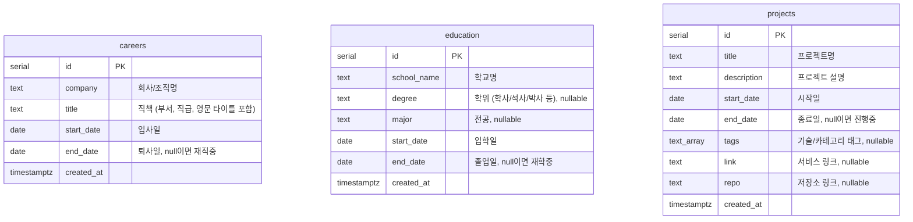

# DB ERD

포트폴리오 사이트의 경력(career)/학력(education)/프로젝트(project) 데이터를 위한 스키마입니다.
Drizzle 스키마 정의: [src/db/schema.ts](../../src/db/schema.ts)

## 참고

- `careers`, `education`, `projects`는 서로 참조 관계가 없는 독립된 엔티티입니다. `projects`의 기간이 특정 `careers` 항목과 겹치는 경우가 있지만(같은 시기에 진행한 프로젝트라서) FK로 연결하지는 않았습니다 — 프로젝트가 항상 경력 하나에만 대응한다는 보장이 없어서입니다.
- 원본 하드코딩 데이터(`src/data/portfolio.ts`의 `history`, `projects`)는 `"YYYY.MM ~ YYYY.MM"` 형식의 문자열이라 일(day) 단위 정보가 없습니다. 마이그레이션 시 각 달의 1일(`01`)로 채웠습니다 — 실제 날짜가 있다면 이후에 수정하세요.
- `careers.company` 필드는 원본 문자열 맨 앞의 조직명을 분리한 값입니다 (예: `"카카오 UX 디자인설계팀 팀장"` → company `"카카오"`, title `"UX 디자인설계팀 팀장"`). "카카오톡"처럼 조직명이 아닌 서비스명으로 시작하는 항목은 그대로 title에 남겨뒀습니다.
- `education`은 코드에 하드코딩된 데이터가 없어 테이블만 생성하고 데이터는 비워뒀습니다.
- `projects.tags`/`link`/`repo`는 원본 `Project` 타입에는 있었지만 실제 하드코딩 데이터 5건 모두 값이 없어 전부 `null`로 들어갔습니다.
